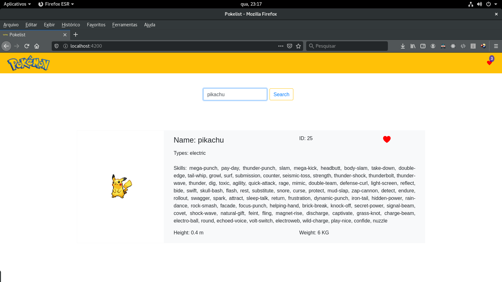
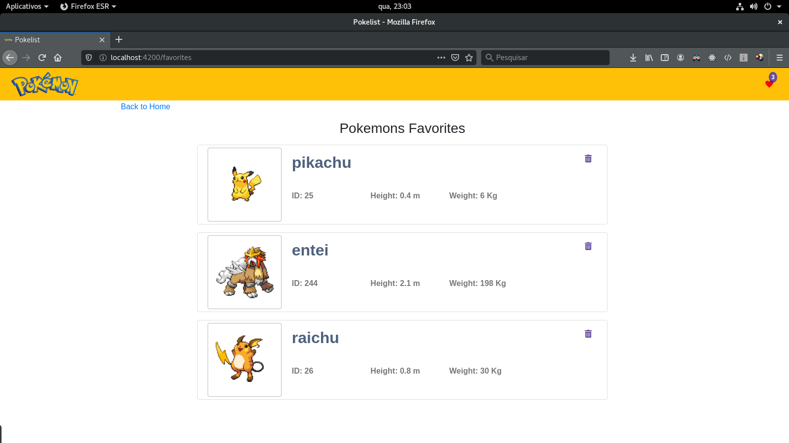

# Pokelist

This project was generated with [Angular CLI](https://github.com/angular/angular-cli) version 11.2.7.

## Install dependences
Run the following command for install dependences necessary.

```shell
    npm install
```

## Run the application
Run the following command for start application 

```shell
    ng serve --open
```
## Screen Home


.. image:: ./screen_home.png
   :height: 300px
   :width: 300px

## Screen of the list of favorite pokemon

.. image:: ./screen_favorite_pokemons.png
   :height: 300px
   :width: 300px
